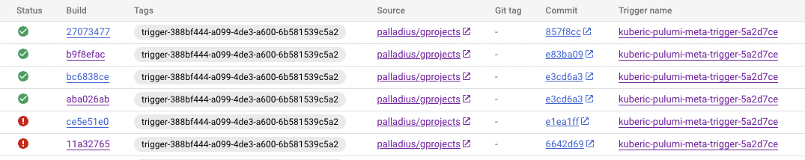

# Setting a ⬣ Cloud Build trigger with 🧹Pulumi in 🐍 Python

Currently 🧹 Work in progress

* Article: https://medium.com/@palladiusbonton/setting-cloudbuild-with-pulumi-in-python-330e8b54b2cf

## INSTALL

* Install Pulumi
* branch this code in a repo you own (you need to be able to commit to that repo).
* Connect with Cloud Build - unfortunately we can't automate it just yet.
* Finally configure and run this code.

## Pulumi setup

Set up your env vars:

```
# GCP stuff
pulumi config set gcp:project your-gcp-project-id # Your project id. I cant do it for you :)
pulumi config set gcp:region <your-region> # e.g us-west1
pulumi config set gcp:zone   <your-zone> # e.g us-west1-b
# Module-related stuff
pulumi config set app_name 'My app - you can change me' # beware to weird chars, this goes into GCP descriptions
pulumi config set app_name_lower 'mycloudbuilddemo'
pulumi config set favourite_color 'fuxia' # this is 100% pointless.
pulumi config set cloud-build-access-token YOUR_TOKEN_SEE_BELOW --secret # get it from https://app.pulumi.com/YOUR_ACCOUNT/settings/tokens
pulumi config set password PICK_STH_RANDOM # this doesnt really matter and pulumi encrypts it for you. Its for the GKE cluster, not majorluy useful to us.
# This will be set later but the scripts wants you to set ip up anyhow. Sorry about my poor programming skills
#pulumi config set cloud-build-executing-script-at not-yet
pulumi config set cloudbuild-repository-name "palladius/pulumi" # or whatever is your repo.
```

* **How to get the token**. Create it [here](https://app.pulumi.com/account/tokens) and save the value in your config/repo.
* **How to get repository_id**. Go to Cloud Build -> Connect Repository > Github or whatever you chose > Create Sample Trigger called 'sample-trigger-1'.
  * Now find the name with `gcloud beta builds triggers list  --project XXX | grep repoName` (I know I jknow...) or simply
  * `gcloud beta builds triggers describe sample-trigger-1`
## Results

When it works, you should see this:


