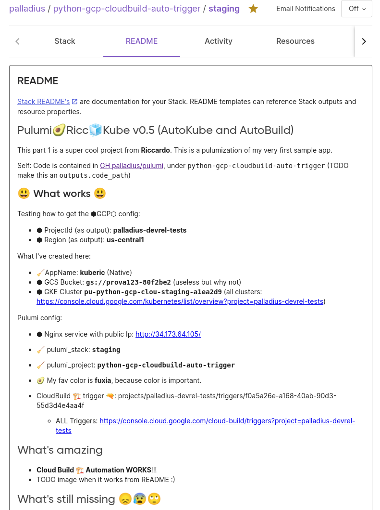

# Setting a ⬣ Cloud Build trigger with 🧹Pulumi in 🐍 Python

* [Article on 🖕](https://medium.com/@palladiusbonton/setting-cloudbuild-with-pulumi-in-python-330e8b54b2cf)
* [Slides on Drive](https://docs.google.com/presentation/d/1LgQLOznGLnmUrJg24X47dZsSAqmtEgrzSpfeaaqygGM/edit) (ask me for access if you care). I'm going to put them on my website soon.

## INSTALL

* Install 🧹 Pulumi
* `cp Pulumi.dev-copyme.yaml Pulumi.dev.yaml`
* branch this code in a repo you own (you need to be able to commit to that repo).
* [Connect with Cloud Build](https://cloud.google.com/build/docs/automating-builds/github/build-repos-from-github) - unfortunately we can't automate it just yet.
* Finally configure and run this code.

## Pulumi setup

Set up your env vars. Easiest way is to edit the YAML but you can also do it from CLI. I recommend setting secrets from CLI so they get stored in encrypted way (if you trust your local machine).

```bash
# GCP stuff
pulumi config set gcp:project your-project-id # Your project id. I cant do it for you :)
pulumi config set gcp:region <your-region>    # e.g us-west1
pulumi config set gcp:zone   <your-zone>      # e.g us-west1-b
# Module-related stuff
pulumi config set app_name 'My app - you can change me' # to be fair, this is useless. So leave as is
pulumi config set app_name_lower 'mycloudbuilddemo' # this *IS* used as base for GCP names.
pulumi config set favourite_color 'fuxia' # this is 100% pointless.
pulumi config set cloud-build-access-token 'YOUR_TOKEN_SEE_BELOW' --secret # get it from https://app.pulumi.com/YOUR_ACCOUNT/settings/tokens
pulumi config set password 'PICK_STH_RANDOM123' --secret # this doesnt really matter and pulumi encrypts it for you. Its for the GKE cluster, not majorluy useful to us.
# This will be set later but the scripts wants you to set ip up anyhow. Sorry about my poor programming skills
#pulumi config set cloudbuild-repository-name "palladius/pulumi" # USELESS, I refactored it into the following 2:
pulumi config set gcb_gh_name  'pulumi'
pulumi config set gcb_gh_owner 'palladius'
# This is needed since no library provides `pulumi whoami` out of the box, hope this gets fixed.
pulumi config set pulumi-user $(pulumi whoami) # damn I cant find the code to do this programmatically
```

* **How to get the token**. Create it [here](https://app.pulumi.com/account/tokens) and save the value in your config/repo.
* **How to get repository_id**. Go to Cloud Build -> Connect Repository > Github or whatever you chose > Create Sample Trigger called 'sample-trigger-1'.
  * Now find the name with `gcloud beta builds triggers list  --project XXX | grep repoName` (I know I jknow...) or simply
  * `gcloud beta builds triggers describe sample-trigger-1`

## Results

When it works, you should see this:


Plus the README is a real candy. I like to add all kind of treats, Cloud Developer Console (UI) links for my lazy hand
to just click upon :)



## GCP under the hood (How it works)

When you connect a github or bitbucket repo, two different things will happen:

* **Github**: GCP will use an auth token for the Cloud Build app attached to it.
* **BitBucket**: GCP will mirror your project through Cloud Source Repositories and call it something like "bitbucket_USER_REPO". So my `palladius/gprojects` will become `bitbucket_palladius_gprojects`.
